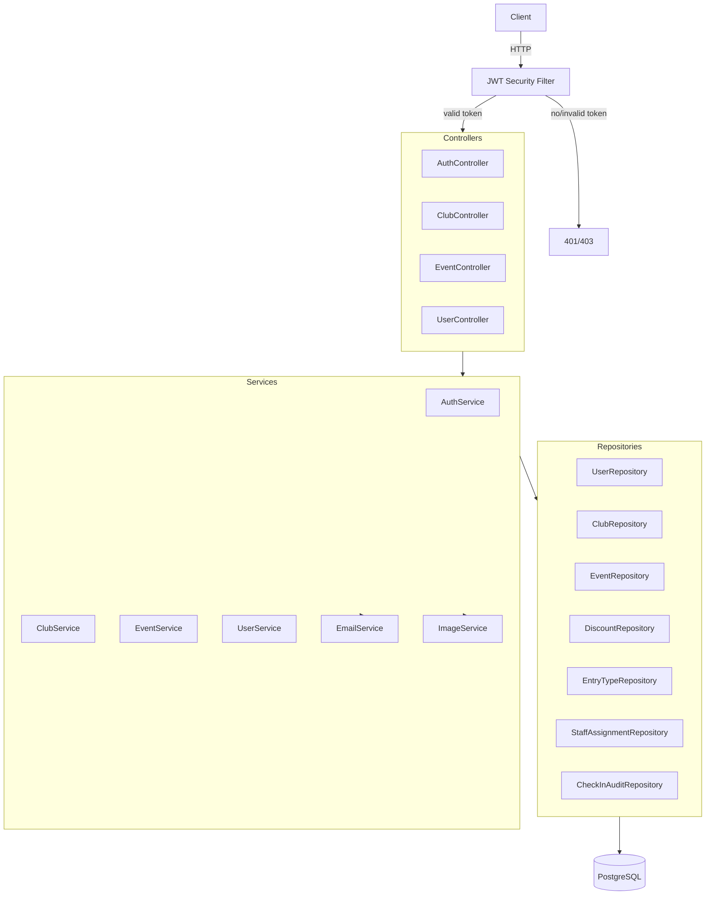
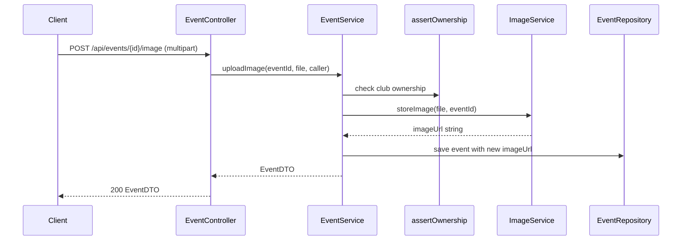

# Design Document: Gig Guide Application

## Overview

The Gig Guide Application is a Spring Boot 3.x REST API backed by PostgreSQL. It supports three authenticated roles (ADMIN, CLUB_OWNER, STAFF) and unauthenticated public browsing. Authentication is stateless JWT-based with short-lived access tokens (1 hour) and longer-lived refresh tokens (7 days). The system is built on an existing partial codebase and this design specifies what must be created, what must be modified, and what can be kept as-is.

Legend used throughout this document:
- [NEW] - must be created from scratch
- [MODIFY] - existing file that needs changes
- [KEEP] - existing file used as-is or with minor additions

---

## Architecture

The application follows a layered architecture: Controller -> Service -> Repository -> Database. A JWT filter sits in the Spring Security filter chain and validates every protected request before it reaches a controller.



Key design decisions:
- The existing MyAppUser model is retired in favour of the richer User model (which already has role, club linkage, and isActive). All authentication will use User via UserRepository.
- Spring Security is re-enabled (currently commented out). The SecurityConfig is rewritten to use a stateless JWT filter chain.
- Redis is already in the pom.xml and application.properties; it will be used to store refresh tokens for fast invalidation on logout.
- Image uploads are stored on the local filesystem under a configurable directory and served via a static resource mapping. An external URL option is also supported.


---

## Components and Interfaces

### Security Layer

JwtAuthFilter [NEW] - Security/JwtAuthFilter.java
- Extends OncePerRequestFilter
- Extracts Authorization: Bearer token header
- Calls JwtTokenUtil.extractEmail(token) and JwtTokenUtil.validateToken(token)
- Loads UserDetails from UserDetailsServiceImpl and sets SecurityContextHolder
- On missing/invalid token: lets the request proceed unauthenticated (Spring Security handles 401/403)

UserDetailsServiceImpl [NEW] - Security/UserDetailsServiceImpl.java
- Implements UserDetailsService
- Loads User from UserRepository.findByUsername(username)
- Returns a UserDetails wrapping the User's email, hashed password, and role as a GrantedAuthority

SecurityConfig [MODIFY] - replaces the commented-out class
- Stateless session (SessionCreationPolicy.STATELESS)
- Adds JwtAuthFilter before UsernamePasswordAuthenticationFilter
- Public endpoints: GET /api/events/**, GET /api/clubs/**, POST /api/auth/**, GET /req/signup/verify
- Role-based rules: ADMIN-only paths, CLUB_OWNER + ADMIN paths, STAFF + CLUB_OWNER + ADMIN paths
- Exposes AuthenticationManager bean

JwtTokenUtil [MODIFY]
- Add generateToken(String subject, long expiryMs) overload to support configurable expiry
- Add extractRole(String token) to read the role claim
- Modify generateToken to embed the user's role as a claim
- Keep existing validateToken, extractEmail, isTokenExpired

### Controllers

AuthController [NEW] - Controllers/UserControllers/AuthController.java, base path /api/auth
- POST /register - club owner / staff registration
- POST /login - returns AuthResponseDTO
- POST /refresh - exchange refresh token for new access token
- POST /logout - invalidate refresh token
- POST /forgot-password - trigger password reset email
- POST /reset-password - apply new password with reset token

ClubController [MODIFY] - existing file, base path /api/clubs
- Keep existing CRUD endpoints
- Add PATCH /{id}/deactivate (ADMIN only)
- Add cascade logic to existing DELETE /{id}
- Update GET / to use Pageable

EventController [NEW] - Controllers/EventController.java, base path /api/events
- GET / - public paginated list of PUBLISHED future events
- GET /{id} - public single event
- GET /club/{clubId} - public events by club
- GET /dashboard - authenticated club dashboard (CLUB_OWNER, STAFF)
- POST / - create event (CLUB_OWNER, STAFF, ADMIN)
- PUT /{id} - update event
- DELETE /{id} - delete event (CLUB_OWNER, ADMIN only)
- PATCH /{id}/status - transition event status
- POST /{id}/checkin - check in attendee
- POST /{id}/checkout - check out attendee
- GET /{id}/audit - paginated audit log (CLUB_OWNER, ADMIN)
- POST /{id}/discounts - add discount
- PUT /{id}/discounts/{discountId} - update discount
- DELETE /{id}/discounts/{discountId} - delete discount
- POST /{id}/entry-types - add entry type
- PUT /{id}/entry-types/{entryTypeId} - update entry type
- DELETE /{id}/entry-types/{entryTypeId} - delete entry type
- POST /{id}/image - upload image (multipart)
- PATCH /{id}/image-url - set external image URL
- POST /{id}/staff-assignments - assign staff to event (CLUB_OWNER)
- DELETE /{id}/staff-assignments/{userId} - remove staff assignment (CLUB_OWNER)
- GET /{id}/staff-assignments - list staff for event

UserController [NEW] - Controllers/UserControllers/UserController.java, base path /api/users
- POST /staff - create staff account (CLUB_OWNER)
- PATCH /staff/{userId}/deactivate - deactivate staff (CLUB_OWNER, ADMIN)
- PUT /me - update own profile
- GET /staff - list staff in own club (CLUB_OWNER, STAFF)

VerificationController [KEEP] - existing, no changes needed

### Services

AuthService [NEW] - Service/AuthService.java + Service/IMPL/AuthServiceImpl.java
- register(RegisterRequestDTO) -> UserResponseDTO
- login(LoginRequestDTO) -> AuthResponseDTO
- refresh(String refreshToken) -> AuthResponseDTO
- logout(String refreshToken)
- forgotPassword(String email)
- resetPassword(String token, String newPassword)

ClubService [MODIFY] - add deactivateClub(Long id), deleteClubCascade(Long id), update getAllClubs to accept Pageable

EventService [NEW] - Service/EventService.java + Service/IMPL/EventServiceImpl.java
- Full CRUD for events, discounts, entry types
- Check-in / check-out with audit
- Image upload / URL set
- Dashboard query
- Staff assignment management
- Status transition

UserService [NEW] - Service/UserService.java + Service/IMPL/UserServiceImpl.java
- createStaff(RegisterRequestDTO, Long clubId) -> UserResponseDTO
- deactivateUser(Long userId, Long requestingClubId)
- updateProfile(Long userId, UpdateProfileDTO) -> UserResponseDTO
- getStaffByClub(Long clubId) -> List<UserResponseDTO>

ImageService [NEW] - Service/ImageService.java
- storeImage(MultipartFile file, Long eventId) -> String (URL)
- Validates file size against configurable max (default 5 MB)
- Saves to uploads/events/{eventId}/ directory
- Returns accessible URL path

EmailService [KEEP] - existing sendVerificationEmail and sendForgotPasswordEmail methods are already implemented

### Global Exception Handling

GlobalExceptionHandler [NEW] - Exceptions/GlobalExceptionHandler.java
- @RestControllerAdvice
- Handles MethodArgumentNotValidException -> 400 with errors array
- Handles AccessDeniedException -> 403
- Handles ResourceNotFoundException -> 404
- Handles DuplicateResourceException -> 409
- Handles IllegalArgumentException -> 400
- Handles Exception (catch-all) -> 500 with generic message, logs stack trace
- All responses use ErrorResponseDTO


---

## Data Models

### Existing Models (with required modifications)

User [MODIFY] - Models/Users/User.java
- Add @PrePersist to set createdAt, isActive = true
- Add isEmailVerified boolean field (currently handled by MyAppUser; consolidate here)
- Add verificationToken String field
- Add passwordResetToken String field
- Add passwordResetTokenExpiry LocalDateTime field
- The club ManyToOne relationship already exists - keep it

Clubs [MODIFY] - Models/Club/Clubs.java
- Already has isActive - ensure it is used in public queries
- Add @PrePersist to set createdAt, isActive = true (currently in BaseEntity but @PrePersist is missing)

Event [MODIFY] - Models/Event/Event.java
- Add status field: @Enumerated(EnumType.STRING) private EventStatus status
- Add capacity int field
- Add maleRatio int field (default 50)
- Add femaleRatio int field (default 50)
- Add liveMaleCount int field (default 0)
- Add liveFemaleCount int field (default 0)
- Remove entryFee String field (replaced by EntryType collection)
- Add @OneToMany(mappedBy = "event", cascade = CascadeType.ALL, orphanRemoval = true) List<EntryType> entryTypes
- Add @OneToMany(mappedBy = "event", cascade = CascadeType.ALL, orphanRemoval = true) List<Discount> discounts
- Add @PrePersist to set status = DRAFT, liveMaleCount = 0, liveFemaleCount = 0, maleRatio = 50, femaleRatio = 50 when not provided

BaseEntity [MODIFY]
- Add @PrePersist to set createdAt = LocalDateTime.now(), isActive = true

### New Entities

EventStatus [NEW] - Enums/EventStatus.java

```java
public enum EventStatus { DRAFT, PUBLISHED, CANCELLED, COMPLETED }
```

Discount [NEW] - Models/Event/Discount.java

Table: discounts
- id (Long, PK, auto)
- discountType (String, e.g. "PERCENTAGE", "FIXED_AMOUNT", "FREE_ENTRY")
- discountValue (BigDecimal, non-negative)
- description (String)
- validFrom (LocalDateTime)
- validUntil (LocalDateTime)
- event (ManyToOne -> Event, FK: event_id)

EntryType [NEW] - Models/Event/EntryType.java

Table: entry_types
- id (Long, PK, auto)
- name (String, e.g. "EARLY_BIRD", "GENERAL", "VIP")
- price (BigDecimal, non-negative)
- description (String)
- availableQuantity (int, non-negative)
- event (ManyToOne -> Event, FK: event_id)

StaffAssignment [NEW] - Models/Event/StaffAssignment.java

Table: staff_assignments
- id (Long, PK, auto)
- event (ManyToOne -> Event, FK: event_id)
- user (ManyToOne -> User, FK: user_id)
- assignedAt (LocalDateTime)
- Unique constraint: (event_id, user_id)

CheckInAuditEntry [NEW] - Models/Event/CheckInAuditEntry.java

Table: checkin_audit
- id (Long, PK, auto)
- event (ManyToOne -> Event, FK: event_id)
- gender (String: "MALE" or "FEMALE")
- action (String: "CHECK_IN" or "CHECK_OUT")
- performedBy (Long - userId)
- timestamp (LocalDateTime)

RefreshToken [NEW] - stored in Redis (not a JPA entity)

Redis key: "refresh:{tokenValue}"
Redis value: JSON { userId, email, role, expiresAt }
TTL: 7 days

Rationale: Redis already in the stack; O(1) lookup and automatic TTL-based expiry without a DB cleanup job.

PasswordResetToken - stored directly on the User entity as passwordResetToken + passwordResetTokenExpiry fields (no separate table needed given the 1:1 relationship and low volume).


---

## DTO Designs

All DTOs live under DTO/ in the appropriate sub-package.

### AuthResponseDTO [NEW]
- accessToken (String)
- refreshToken (String)
- role (String)

### LoginRequestDTO [KEEP]
- username (String) - used as email for lookup
- password (String)

### RegisterRequestDTO [MODIFY]
- username (String)
- password (String)
- email (String)
- fullName (String)
- phoneNumber (String)
- role (String) - "CLUB_OWNER" or "STAFF" only; ADMIN rejected with 400
- clubId (Long) - required when role = STAFF
- clubName (String) - ADD; required when role = CLUB_OWNER

### UserResponseDTO [MODIFY]
- id (Long)
- username (String)
- email (String)
- fullName (String)
- phoneNumber (String) - ADD
- role (String)
- clubId (Long)
- isActive (boolean) - ADD

### ClubDTO [MODIFY]
- id (Long) - ADD; currently missing
- name (String)
- description (String)
- email (String)
- phone (String)
- website (String)
- logoUrl (String)
- coverImageUrl (String)
- openingHours (String)
- closingHours (String)
- dressCode (String)
- hasParking (boolean)
- hasVIPArea (boolean)
- capacity (int)
- isActive (boolean) - ADD
- address (AddressDTO) - rename from addressDTO for consistency
- socials (SocialsDTO) - rename from socialsdto for consistency

### AddressDTO [KEEP]
- location (String)
- city (String)
- province (String)
- country (String)
- postalCode (String)

### SocialsDTO [KEEP]
- facebookLink (String)
- instagramLink (String)
- twitterLink (String)
- tiktokLink (String)

### EventDTO [MODIFY]
- id (Long)
- name (String)
- description (String)
- startDateTime (LocalDateTime, ISO-8601)
- endDateTime (LocalDateTime, ISO-8601)
- genre (String)
- dressCode (String)
- ageRestriction (String)
- imageUrl (String)
- status (String) - DRAFT, PUBLISHED, CANCELLED, or COMPLETED
- isActive (boolean)
- clubId (Long)
- clubName (String)
- capacity (int)
- maleRatio (int)
- femaleRatio (int)
- liveMaleCount (int)
- liveFemaleCount (int)
- liveTotalCount (int) - computed: liveMaleCount + liveFemaleCount
- liveMalePercentage (double) - computed, 1 decimal place
- liveFemalePercentage (double) - computed, 1 decimal place
- entryTypes (List<EntryTypeDTO>)
- discounts (List<DiscountDTO>)
- NOTE: entryFee field REMOVED

### EntryTypeDTO [NEW]
- id (Long)
- name (String) - e.g. "EARLY_BIRD", "GENERAL", "VIP"
- price (BigDecimal)
- description (String)
- availableQuantity (int)

### DiscountDTO [NEW]
- id (Long)
- discountType (String)
- discountValue (BigDecimal)
- description (String)
- validFrom (LocalDateTime, ISO-8601)
- validUntil (LocalDateTime, ISO-8601)

### CheckInAuditDTO [NEW]
- id (Long)
- eventId (Long)
- gender (String) - "MALE" or "FEMALE"
- action (String) - "CHECK_IN" or "CHECK_OUT"
- performedBy (Long) - userId of the Staff or Club_Owner who performed the action
- timestamp (LocalDateTime, ISO-8601)

### CheckInRequestDTO [NEW]
- gender (String) - "MALE" or "FEMALE"

### StatusTransitionDTO [NEW]
- status (String) - target status

### UpdateProfileDTO [NEW]
- fullName (String)
- phoneNumber (String)

### ImageUrlDTO [NEW]
- imageUrl (String)

### ErrorResponseDTO [NEW]
- timestamp (LocalDateTime)
- status (int)
- error (String)
- message (String)
- errors (List<FieldErrorDTO>) - populated on validation failures

### PagedResponseDTO<T> [NEW]
- content (List<T>)
- totalElements (long)
- totalPages (int)
- page (int)
- size (int)


---

## API Endpoint Design

Base path: /api

### Auth - /api/auth

| Method | Path | Auth | Request Body | Response | Notes |
|--------|------|------|-------------|----------|-------|
| POST | /register | None | RegisterRequestDTO | UserResponseDTO 201 | Creates Club + User for CLUB_OWNER; creates User for STAFF |
| POST | /login | None | LoginRequestDTO | AuthResponseDTO 200 | |
| POST | /refresh | None | { "refreshToken": "..." } | AuthResponseDTO 200 | |
| POST | /logout | Bearer | { "refreshToken": "..." } | 200 | Invalidates refresh token in Redis |
| POST | /forgot-password | None | { "email": "..." } | 200 generic message | |
| POST | /reset-password | None | { "token": "...", "newPassword": "..." } | 200 | |

### Clubs - /api/clubs

| Method | Path | Auth | Request Body | Response | Notes |
|--------|------|------|-------------|----------|-------|
| GET | / | None | - | PagedResponseDTO<ClubDTO> 200 | Only active clubs; default sort name ASC |
| GET | /{id} | None | - | ClubDTO 200 | 404 if not found or inactive |
| PUT | /{id} | CLUB_OWNER, ADMIN | ClubDTO | ClubDTO 200 | CLUB_OWNER can only update own club |
| PATCH | /{id}/deactivate | ADMIN | - | 200 | Sets isActive=false, deactivates all users |
| DELETE | /{id} | ADMIN | - | 204 | Cascades to events and staff assignments |

Note: Club creation is handled via POST /api/auth/register with role=CLUB_OWNER, not a separate club endpoint.

### Events - /api/events

| Method | Path | Auth | Request Body | Response | Notes |
|--------|------|------|-------------|----------|-------|
| GET | / | None | - | PagedResponseDTO<EventDTO> 200 | PUBLISHED + future only; default sort startDateTime ASC |
| GET | /{id} | None | - | EventDTO 200 | 404 if not PUBLISHED |
| GET | /club/{clubId} | None | - | PagedResponseDTO<EventDTO> 200 | PUBLISHED only |
| GET | /dashboard | CLUB_OWNER, STAFF | - | PagedResponseDTO<EventDTO> 200 | All statuses for own club; supports ?status=, ?startDate=, ?endDate= |
| POST | / | CLUB_OWNER, STAFF, ADMIN | EventDTO (subset) | EventDTO 201 | Initial status = DRAFT |
| PUT | /{id} | CLUB_OWNER, STAFF, ADMIN | EventDTO (subset) | EventDTO 200 | 403 if not own club |
| DELETE | /{id} | CLUB_OWNER, ADMIN | - | 204 | Staff -> 403 |
| PATCH | /{id}/status | CLUB_OWNER, STAFF, ADMIN | StatusTransitionDTO | EventDTO 200 | Staff cannot set CANCELLED/COMPLETED |
| POST | /{id}/checkin | CLUB_OWNER, STAFF | CheckInRequestDTO | { liveMaleCount, liveFemaleCount, liveTotalCount } 200 | |
| POST | /{id}/checkout | CLUB_OWNER, STAFF | CheckInRequestDTO | same 200 | 400 if count already 0 |
| GET | /{id}/audit | CLUB_OWNER, ADMIN | - | PagedResponseDTO<CheckInAuditDTO> 200 | Staff -> 403 |
| POST | /{id}/discounts | CLUB_OWNER, STAFF | DiscountDTO (no id) | DiscountDTO 201 | |
| PUT | /{id}/discounts/{dId} | CLUB_OWNER, STAFF | DiscountDTO | DiscountDTO 200 | |
| DELETE | /{id}/discounts/{dId} | CLUB_OWNER, STAFF | - | 204 | |
| POST | /{id}/entry-types | CLUB_OWNER, STAFF | EntryTypeDTO (no id) | EntryTypeDTO 201 | |
| PUT | /{id}/entry-types/{etId} | CLUB_OWNER, STAFF | EntryTypeDTO | EntryTypeDTO 200 | |
| DELETE | /{id}/entry-types/{etId} | CLUB_OWNER, STAFF | - | 204 | |
| POST | /{id}/image | CLUB_OWNER, STAFF | multipart/form-data file | EventDTO 200 | |
| PATCH | /{id}/image-url | CLUB_OWNER, STAFF | ImageUrlDTO | EventDTO 200 | |
| POST | /{id}/staff-assignments | CLUB_OWNER | { "userId": Long } | 201 | |
| DELETE | /{id}/staff-assignments/{userId} | CLUB_OWNER | - | 204 | |
| GET | /{id}/staff-assignments | CLUB_OWNER, STAFF | - | List<UserResponseDTO> 200 | |

### Users - /api/users

| Method | Path | Auth | Request Body | Response | Notes |
|--------|------|------|-------------|----------|-------|
| POST | /staff | CLUB_OWNER | RegisterRequestDTO | UserResponseDTO 201 | |
| PATCH | /staff/{userId}/deactivate | CLUB_OWNER, ADMIN | - | 200 | 403 if not own club |
| PUT | /me | CLUB_OWNER, STAFF | UpdateProfileDTO | UserResponseDTO 200 | Role field ignored |
| GET | /staff | CLUB_OWNER, STAFF | - | List<UserResponseDTO> 200 | |

### Pagination Query Parameters (all paginated endpoints)

| Param | Default | Max | Notes |
|-------|---------|-----|-------|
| page | 0 | - | 0-indexed |
| size | 20 | 100 | Capped at 100 silently |
| sort | varies | - | field,direction e.g. startDateTime,asc |


---

## Service Layer Design

### AuthServiceImpl

register(RegisterRequestDTO dto):
1. Validate role is CLUB_OWNER or STAFF (reject ADMIN with 400)
2. Check UserRepository.existsByEmail(dto.email) -> 409 if true
3. Check UserRepository.existsByUsername(dto.username) -> 409 if true
4. If STAFF: verify clubId is provided and club exists
5. Hash password with BCryptPasswordEncoder
6. If CLUB_OWNER: create a Clubs record using dto.clubName, then create User linked to that club
7. If STAFF: create User linked to the existing club
8. Generate verification token via JwtTokenUtil.generateToken(email, 24h)
9. Store token on User.verificationToken
10. Save user, send verification email
11. Return UserResponseDTO

login(LoginRequestDTO dto):
1. Load user by username/email from UserRepository
2. Verify password with BCryptPasswordEncoder.matches
3. Check isEmailVerified -> 403 "Account not verified"
4. Check isActive -> 403 "Account is deactivated"
5. Generate access token (1 hour) with role claim
6. Generate refresh token (UUID, 7 days), store in Redis with key refresh:{token} -> {userId, email, role}
7. Return AuthResponseDTO

refresh(String refreshToken):
1. Look up refresh:{token} in Redis -> 401 "Invalid refresh token" if missing
2. Check stored expiry -> 401 "Refresh token expired" if expired
3. Generate new access token
4. Return AuthResponseDTO (same refresh token, new access token)

logout(String refreshToken):
1. Delete refresh:{token} from Redis

forgotPassword(String email):
1. Look up user by email - if not found, return 200 with generic message (no enumeration)
2. Generate UUID reset token, set expiry = now + 1 hour
3. Store on User.passwordResetToken and User.passwordResetTokenExpiry
4. Send password reset email

resetPassword(String token, String newPassword):
1. Find user by passwordResetToken -> 400 "Invalid reset token" if not found
2. Check passwordResetTokenExpiry -> 400 "Reset token has expired" if past
3. Validate password complexity (min 8 chars, at least one digit and one letter)
4. Hash new password, clear reset token fields, save user

### EventServiceImpl

Club ownership check - a private helper assertOwnership(Long eventId, User caller) that:
- Loads the event
- Verifies event.club.id == caller.club.id OR caller is ADMIN
- Throws AccessDeniedException (-> 403) if not

createEvent(EventDTO dto, User caller):
1. Validate endDateTime > startDateTime
2. Validate capacity >= 1
3. Validate maleRatio + femaleRatio == 100 (default both to 50 if not provided)
4. Set status = DRAFT, liveMaleCount = 0, liveFemaleCount = 0
5. Persist and return EventDTO

checkIn(Long eventId, String gender, User caller):
1. assertOwnership
2. Increment liveMaleCount or liveFemaleCount
3. Persist CheckInAuditEntry with action CHECK_IN
4. Return updated counts

checkOut(Long eventId, String gender, User caller):
1. assertOwnership
2. Check count > 0 -> 400 "Count cannot go below zero" if zero
3. Decrement count
4. Persist CheckInAuditEntry with action CHECK_OUT

getPublicEvents(Pageable pageable):
- Query: status = PUBLISHED AND startDateTime > now() ordered by startDateTime ASC

getDashboardEvents(User caller, EventStatus status, LocalDate startDate, LocalDate endDate, Pageable pageable):
- Query: club = caller.club with optional filters

transitionStatus(Long eventId, String targetStatus, User caller):
1. assertOwnership
2. If caller is STAFF and target is CANCELLED or COMPLETED -> 403
3. Apply transition, save, return EventDTO

getPublicEventById(Long id):
- Load event; if status != PUBLISHED -> 404 "Event not found"
- Populate entryTypes (all), discounts (only where validFrom <= now <= validUntil)

Live percentage calculation (in mapper/service):
- liveTotalCount = liveMaleCount + liveFemaleCount
- liveMalePercentage = liveTotalCount == 0 ? 0.0 : round((liveMaleCount / liveTotalCount) * 100, 1)
- liveFemalePercentage = liveTotalCount == 0 ? 0.0 : round((liveFemaleCount / liveTotalCount) * 100, 1)

### ImageServiceImpl

Configuration:
- MAX_FILE_SIZE = 5 MB (configurable via app.image.max-size-bytes)
- UPLOAD_DIR = uploads/events/ (configurable via app.image.upload-dir)

Steps:
1. Validate file.size <= MAX_FILE_SIZE -> 400 if exceeded
2. Generate filename: {eventId}_{UUID}.{extension}
3. Write to UPLOAD_DIR/{eventId}/
4. Return URL: /images/events/{eventId}/{filename} (served via Spring's static resource handler)


---

## Security Design

### JWT Access Token

- Algorithm: HS256 (existing JwtTokenUtil uses this)
- Expiry: 1 hour (3,600,000 ms)
- Claims: sub (email), role, iat, exp
- Secret key: generated at startup (existing behaviour) - for production, externalise to application.properties as a Base64-encoded secret

### Refresh Token

- Stored in Redis as refresh:{uuid} with TTL of 7 days
- Value: JSON { "userId": ..., "email": ..., "role": ..., "expiresAt": "..." }
- On logout: key is deleted, token immediately invalid
- On refresh: key is looked up; if missing -> 401 "Invalid refresh token"

### Role-Based Access Control

| Role | Permitted actions |
|------|------------------|
| ADMIN | Everything |
| CLUB_OWNER | Own club CRUD, own events, own staff management, check-in/out, audit log |
| STAFF | Own club events (no delete, no CANCELLED/COMPLETED transition), check-in/out, own profile |
| Unauthenticated | Public GET /api/events/**, GET /api/clubs/**, POST /api/auth/** |

### Filter Chain Order

Request -> CorsFilter -> JwtAuthFilter -> UsernamePasswordAuthenticationFilter -> ...

JwtAuthFilter sets the SecurityContext if a valid token is present. If no token is present, the request proceeds unauthenticated and Spring Security's AuthorizationFilter enforces the URL rules.

### Password Policy

Minimum complexity for reset-password: at least 8 characters, at least one letter, at least one digit. Validated in AuthServiceImpl.resetPassword before hashing.

---

## Email Service Design

The existing EmailService already implements both sendVerificationEmail and sendForgotPasswordEmail with HTML email templates. No structural changes are needed.

Verification flow:
1. User registers -> AuthService calls emailService.sendVerificationEmail(email, token)
2. User clicks link -> GET /req/signup/verify?token=... -> VerificationController validates token, sets isEmailVerified = true on User

Password reset flow:
1. User calls POST /api/auth/forgot-password -> AuthService calls emailService.sendForgotPasswordEmail(email, token)
2. User clicks link -> POST /api/auth/reset-password with token + new password

---

## Image Upload Design



Static resource serving is configured in WebMvcConfig [NEW]:

```java
registry.addResourceHandler("/images/**")
        .addResourceLocations("file:" + uploadDir + "/");
```

---

## Pagination Design

All list endpoints accept Spring's Pageable via @PageableDefault. The service layer passes Pageable directly to repository Page<T> return methods.

Size capping is applied in a PageableHandlerMethodArgumentResolverCustomizer bean [NEW] that enforces max = 100.

The controller maps Page<T> to PagedResponseDTO<DTO>:

```java
PagedResponseDTO.of(page.getContent().stream().map(mapper).toList(),
                    page.getTotalElements(), page.getTotalPages(),
                    page.getNumber(), page.getSize())
```

Default sorts:
- Events: startDateTime,asc via @PageableDefault(sort = "startDateTime", direction = Sort.Direction.ASC)
- Clubs: name,asc via @PageableDefault(sort = "name", direction = Sort.Direction.ASC)

---

## Error Handling Design

All error responses conform to ErrorResponseDTO:

```json
{
  "timestamp": "2025-01-15T10:30:00",
  "status": 400,
  "error": "Bad Request",
  "message": "End date must be after start date",
  "errors": null
}
```

On validation failure:

```json
{
  "timestamp": "2025-01-15T10:30:00",
  "status": 400,
  "error": "Bad Request",
  "message": "Validation failed",
  "errors": [
    { "field": "email", "message": "must be a well-formed email address" }
  ]
}
```

Custom exception classes [NEW]:
- ResourceNotFoundException (-> 404)
- DuplicateResourceException (-> 409)
- ClubOwnershipException (-> 403)
- InvalidTokenException (-> 400/401 depending on context)

The GlobalExceptionHandler catches all of these plus Spring's built-in exceptions and a catch-all Exception handler that logs the stack trace and returns 500 with "An unexpected error occurred".


---

## Correctness Properties

*A property is a characteristic or behavior that should hold true across all valid executions of a system - essentially, a formal statement about what the system should do. Properties serve as the bridge between human-readable specifications and machine-verifiable correctness guarantees.*

### Property 1: Valid registration creates both Club and User

*For any* valid registration payload with role CLUB_OWNER (unique email, username, all required fields present), submitting it should result in exactly one Club record and one User record with role CLUB_OWNER being persisted in the database.

**Validates: Requirements 1.1**

### Property 2: Duplicate email registration is rejected

*For any* registered user, attempting to register again with the same email should return HTTP 409 and leave the user count unchanged.

**Validates: Requirements 1.2**

### Property 3: Missing required fields are rejected

*For any* registration request where at least one required field (email, username, password, fullName) is blank or null, the system should return HTTP 400 and no user should be persisted.

**Validates: Requirements 1.3**

### Property 4: Passwords are stored as BCrypt hashes

*For any* registered user, the password stored in the database should be a valid BCrypt hash (not the plaintext value), such that BCryptPasswordEncoder.matches(plaintext, stored) returns true.

**Validates: Requirements 1.4**

### Property 5: Unverified accounts cannot log in

*For any* user account where isEmailVerified = false, a login attempt with correct credentials should return HTTP 403 with the message "Account not verified".

**Validates: Requirements 1.6**

### Property 6: Valid login returns all three token fields

*For any* verified, active user account, a login request with correct credentials should return an AuthResponseDTO containing a non-null accessToken, a non-null refreshToken, and the correct role string.

**Validates: Requirements 2.1**

### Property 7: Invalid credentials are rejected

*For any* login request where the email does not exist or the password does not match, the system should return HTTP 401 with the message "Invalid credentials".

**Validates: Requirements 2.2**

### Property 8: Deactivated accounts cannot log in

*For any* user account where isActive = false, a login attempt should return HTTP 403 with the message "Account is deactivated".

**Validates: Requirements 2.3**

### Property 9: Access tokens expire in exactly 1 hour

*For any* generated access token, the exp claim should equal the iat claim plus exactly 3,600 seconds.

**Validates: Requirements 2.4**

### Property 10: Protected endpoints require a valid token

*For any* protected endpoint, a request without an Authorization header (or with a malformed/expired token) should return HTTP 401.

**Validates: Requirements 2.5**

### Property 11: Refresh token round trip

*For any* valid refresh token, submitting it to POST /api/auth/refresh should return a new, valid access token with HTTP 200. After logout, the same refresh token should return HTTP 401.

**Validates: Requirements 2.8, 2.11**

### Property 12: Invalid refresh tokens are rejected

*For any* string that is not a currently valid refresh token (random UUID, expired token, already-used token), submitting it to the refresh endpoint should return HTTP 401.

**Validates: Requirements 2.10**

### Property 13: Admin-only actions reject non-admin tokens

*For any* endpoint that requires the ADMIN role, a request authenticated with a CLUB_OWNER or STAFF token should return HTTP 403.

**Validates: Requirements 3.6**

### Property 14: Club deactivation cascades to users

*For any* club with associated user accounts, when an admin deactivates the club, all associated users should have isActive = false and the club should have isActive = false.

**Validates: Requirements 3.2**

### Property 15: Club deletion cascades to events and staff assignments

*For any* club with associated events and staff assignments, when an admin deletes the club, all associated events and staff assignments should also be removed from the database.

**Validates: Requirements 3.3**

### Property 16: New events are created with DRAFT status

*For any* valid create-event request from a CLUB_OWNER or STAFF, the persisted event should have status = DRAFT and the response should be HTTP 201.

**Validates: Requirements 4.1, 15.2**

### Property 17: Invalid date ranges are rejected

*For any* create-event or update-event request where endDateTime is not strictly after startDateTime, the system should return HTTP 400 with the message "End date must be after start date".

**Validates: Requirements 4.2**

### Property 18: Cross-club event access is forbidden

*For any* CLUB_OWNER or STAFF user, an update or delete request targeting an event that belongs to a different club should return HTTP 403.

**Validates: Requirements 4.4**

### Property 19: Invalid capacity is rejected

*For any* create-event or update-event request with capacity less than 1, the system should return HTTP 400 with the message "Capacity must be at least 1".

**Validates: Requirements 4.6**

### Property 20: Invalid gender ratios are rejected

*For any* event request where maleRatio + femaleRatio does not equal 100, the system should return HTTP 400 with the message "Male and female ratios must sum to 100".

**Validates: Requirements 5.2**

### Property 21: Cross-club staff assignment is forbidden

*For any* staff assignment request where the target user does not belong to the same club as the event, the system should return HTTP 403.

**Validates: Requirements 6.2**

### Property 22: Public event list contains only PUBLISHED future events

*For any* set of events with mixed statuses and dates, the public GET /api/events endpoint should return only events where status = PUBLISHED and startDateTime is after now, ordered by startDateTime ascending.

**Validates: Requirements 7.1, 15.6**

### Property 23: Non-published events return 404 on public retrieval

*For any* event with status DRAFT, CANCELLED, or COMPLETED, a public GET /api/events/{id} request should return HTTP 404 with the message "Event not found".

**Validates: Requirements 7.2**

### Property 24: Public club list contains only active clubs

*For any* set of clubs with mixed isActive values, the public GET /api/clubs endpoint should return only clubs where isActive = true.

**Validates: Requirements 8.1**

### Property 25: Staff creation links user to correct club

*For any* valid create-staff request from a CLUB_OWNER, the created user should have role = STAFF and club equal to the requesting owner's club.

**Validates: Requirements 9.1**

### Property 26: Role cannot be changed via profile update

*For any* profile update request, the user's role in the database should remain unchanged after the update.

**Validates: Requirements 9.5**

### Property 27: Error responses have required fields

*For any* error condition (4xx or 5xx), the response body should be a JSON object containing timestamp, status, error, and message fields.

**Validates: Requirements 10.1**

### Property 28: Validation failures include field-level errors

*For any* request body that fails bean validation, the response should be HTTP 400 with an errors array where each entry contains a field name and a message.

**Validates: Requirements 10.2**

### Property 29: Invalid discount date ranges are rejected

*For any* discount request where validUntil is not strictly after validFrom, the system should return HTTP 400 with the message "Discount end time must be after start time".

**Validates: Requirements 11.3**

### Property 30: Negative discount values are rejected

*For any* discount request with discountValue less than 0, the system should return HTTP 400 with the message "Discount value must be non-negative".

**Validates: Requirements 11.4**

### Property 31: Active discounts are included in public event response

*For any* event with multiple discounts at various validity periods, the public event response should include only discounts where validFrom is before or equal to now and validUntil is after or equal to now.

**Validates: Requirements 11.8**

### Property 32: Check-in increments count and creates audit entry

*For any* check-in request on a valid event by an authorised user, the corresponding live count (liveMaleCount or liveFemaleCount) should increase by exactly 1, and a CheckInAuditEntry with action CHECK_IN should be persisted.

**Validates: Requirements 12.2**

### Property 33: Live percentages are correctly computed

*For any* event with liveMaleCount and liveFemaleCount, the liveMalePercentage and liveFemalePercentage in the EventDTO should equal (count / total) * 100 rounded to one decimal place; when liveTotalCount = 0, both percentages should be 0.0.

**Validates: Requirements 12.5**

### Property 34: Negative entry type price is rejected

*For any* create-entry-type or update-entry-type request with price less than 0, the system should return HTTP 400 with the message "Entry type price must be non-negative".

**Validates: Requirements 16.2**

### Property 35: Negative available quantity is rejected

*For any* create-entry-type or update-entry-type request with availableQuantity less than 0, the system should return HTTP 400 with the message "Available quantity must be non-negative".

**Validates: Requirements 16.3**

### Property 36: Dashboard returns all statuses for own club

*For any* CLUB_OWNER or STAFF user, the dashboard endpoint should return events of all statuses (DRAFT, PUBLISHED, CANCELLED, COMPLETED) belonging to their club, and no events from other clubs.

**Validates: Requirements 18.1, 18.6**

### Property 37: Dashboard status filter works correctly

*For any* dashboard request with a status query parameter, the returned events should all have exactly that status.

**Validates: Requirements 18.2**

### Property 38: Password reset token round trip

*For any* user who requests a password reset and uses the token to set a new password, the old token should no longer be valid and the new password should authenticate successfully.

**Validates: Requirements 19.3**

### Property 39: Pagination size is capped at 100

*For any* paginated endpoint request with size greater than 100, the response should contain at most 100 items.

**Validates: Requirements 20.2**

### Property 40: Paginated responses have required shape

*For any* paginated endpoint, the response should contain content, totalElements, totalPages, page, and size fields.

**Validates: Requirements 20.6**


---

## Testing Strategy

### Dual Testing Approach

Both unit tests and property-based tests are required. They are complementary:
- Unit tests catch concrete bugs in specific scenarios and integration points
- Property-based tests verify universal correctness across many generated inputs

### Property-Based Testing

Library: jqwik (https://jqwik.net/) - a property-based testing library for Java that integrates with JUnit 5.

Add to pom.xml:

```xml
<dependency>
    <groupId>net.jqwik</groupId>
    <artifactId>jqwik</artifactId>
    <version>1.8.1</version>
    <scope>test</scope>
</dependency>
```

Configuration: Each @Property test runs a minimum of 100 tries (@Property(tries = 100)).

Tag format: Each property test must include a comment referencing the design property:

```java
// Feature: gig-guide-app, Property 16: New events are created with DRAFT status
```

Each correctness property above maps to exactly one @Property test method.

Example structure:

```java
@Property(tries = 100)
void newEventsAreCreatedWithDraftStatus(
        @ForAll @From("validEventDTOs") EventDTO dto,
        @ForAll @From("clubOwnerUsers") User caller) {
    // Feature: gig-guide-app, Property 16: New events are created with DRAFT status
    EventDTO result = eventService.createEvent(dto, caller);
    assertThat(result.getStatus()).isEqualTo("DRAFT");
}
```

### Unit Testing

Framework: JUnit 5 + Mockito (already in spring-boot-starter-test)

Unit tests focus on:
- Specific examples that demonstrate correct behaviour (e.g. a single successful login)
- Integration points between components (e.g. AuthService calls EmailService)
- Edge cases: checkout when count is 0, oversized image upload, expired reset token
- Error conditions: 404 on missing resource, 409 on duplicate email

Avoid writing unit tests for scenarios already covered by property tests.

### Test Scope by Layer

| Layer | Test type | Tool |
|-------|-----------|------|
| Service logic | Property tests | jqwik |
| Service logic | Unit tests (examples/edge cases) | JUnit 5 + Mockito |
| Controller | Integration tests (slice) | @WebMvcTest + MockMvc |
| Repository | Integration tests | @DataJpaTest + H2 or Testcontainers |
| Security filter | Integration tests | @SpringBootTest + MockMvc |

### Key Test Scenarios (Unit / Example Tests)

- Successful club owner registration -> Club + User created, email sent
- Login with unverified account -> 403
- Logout then refresh -> 401
- Staff attempts to delete event -> 403
- Staff attempts to set event status to CANCELLED -> 403
- Check-out when liveMaleCount = 0 -> 400
- Image upload exceeding 5 MB -> 400
- Forgot-password with unknown email -> 200 generic message (no enumeration)
- Reset password with expired token -> 400
- Admin deactivates club -> all users deactivated
- Public event list excludes DRAFT events
- Dashboard includes DRAFT events for own club
